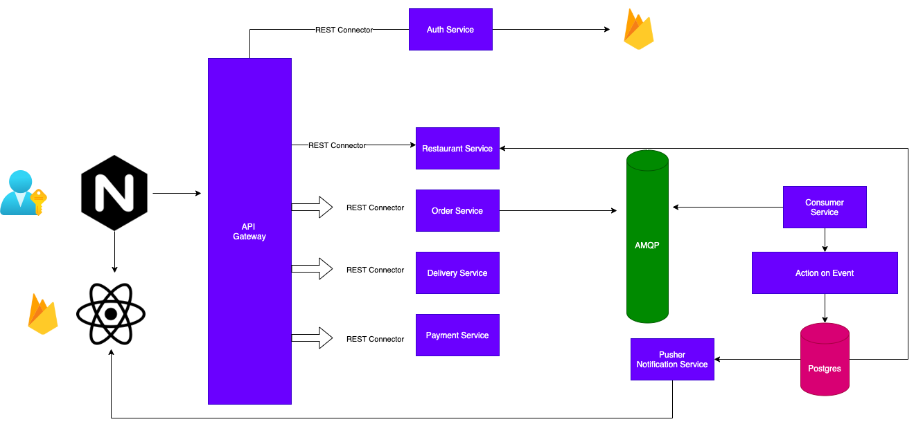

## Swiggy Clone App

<h1 align="center">
  Swiggy Clone
  <br>
</h1>

<h4 align="center">Swiggy clone app made for educational purpose.</h4>


<p align="center">
  <a href="#key-features">Key Features</a> •
  <a href="#how-to-use">How To Use</a> •
  <a href="#download">Download</a> •
  <a href="#credits">Credits</a> •
  <a href="#related">Related</a> •
  <a href="#license">License</a>
</p>

## Key Features

- TBD

## Key Microservices

- TBD

## Application services

| app    | port |
| -------- | ------- |
| proxy  |  80    |
| user service | 3001     |
| restaurant service | 3002     |
| cart service | 3003     |
| order service | 3004    |
| payment service | 3005   |
| delivery service | 3006    |
| MQ Listener service | 3001     |

## How To Use

To clone and run this application, you'll need [Git](https://git-scm.com) and [Node.js](https://nodejs.org/en/download/) (which comes with [npm](http://npmjs.com)) installed on your computer. From your command line:

```bash
# Clone this repository
$ git clone https://github.com/saurav475/swiggy-clone.git

# Go into the repository
$ cd swiggy-clone

# Install dependencies
$ pnpm i

```

- App Architecture & Database diagram





